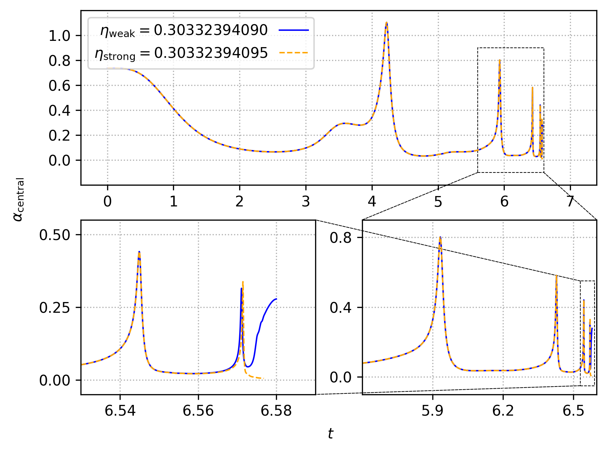
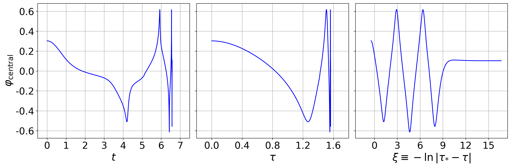

# NRPyCritCol_Ccodes

This repository contains the original version of `NRPyCritCol` that was
used to produce the results in [Werneck *et al.*
(2021)](https://arxiv.org/pdf/2106.06553.pdf). For the sake of the user,
we also provide scripts that will aid in the task of reproducing some of
the results in the paper.

***Note***: While this is the original code used for the paper, the
critical solution is extremely sensitive to any changes made to the
code, including those which produce round-off level
disagreements. Our experiments with the code indicate that changing the
system in which you run the executable or even the compiler version used
to generate the executable might result in slight variations of the
late-time behavior of the critical solution, which means that it is
possible that the plot that you generate when running the scripts below
will look slightly different from ours.

After cloning the repository to your local machine, please run

`$: make`

which will both compile `NRPyCritCol`, generating an executable with the same
name, and run the script `generate_runscript.py`, which creates the
`runscript.sh` script. You should then run

`$: ./runscript.sh`

which will execute `NRPyCritCol` twice, once with a subcritical value of
the scalar field amplitude and once with a supercritical value of the
scalar field amplitude. This step should take 10-30 minutes to complete,
depending on your system.

After `NRPyCritCol` finishes running, the `runscript.sh` will generate
the plots below for you by running the `generate_plots.py` script. The
first plot (`lapse_self_similarity.png`) reproduces Fig.~3 in [Werneck *et al.*
(2021)](https://arxiv.org/pdf/2106.06553.pdf), while the second plot
(`central_scalar_field.png`) provides an analog of Fig.~4 for the case
of our BSSN code. We display below what you should expect these plots to
look like.

